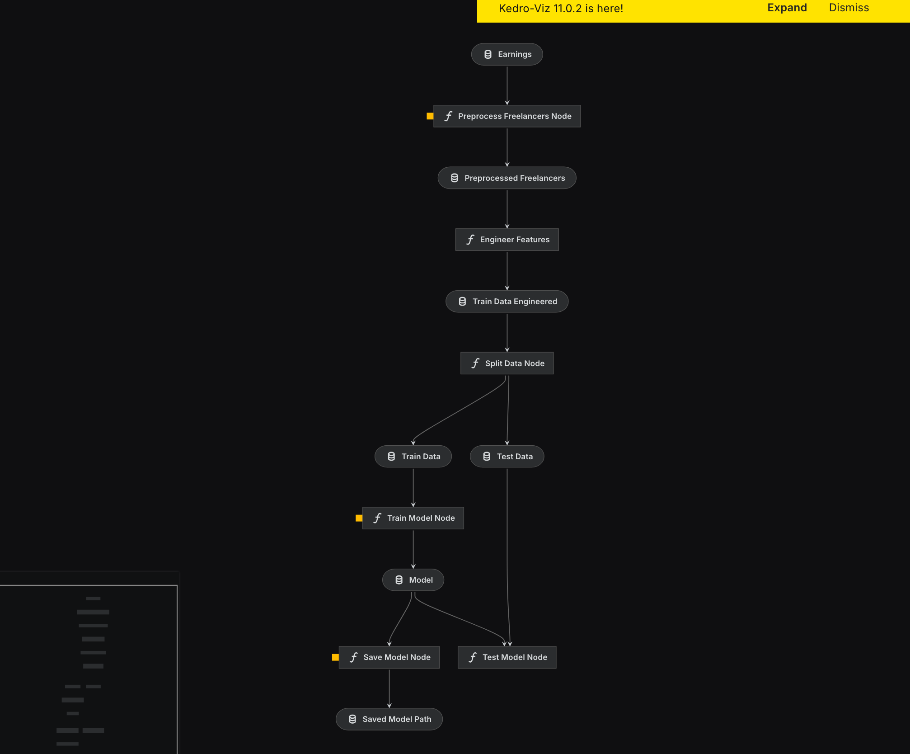

# Freelancers success rate

Model Rating:
```
Fitting model: LightGBM ...
        0.7107   = Validation score   (f1_macro)
        8.0s     = Training   runtime
        0.01s    = Validation runtime
Fitting model: RandomForest ...
        0.5349   = Validation score   (f1_macro)
        0.41s    = Training   runtime
        0.03s    = Validation runtime
Fitting model: CatBoost ...
        0.9023   = Validation score   (f1_macro)
        24.06s   = Training   runtime
        0.01s    = Validation runtime
Fitting model: ExtraTrees ...
        0.3104   = Validation score   (f1_macro)
        0.31s    = Training   runtime
        0.03s    = Validation runtime
Fitting model: NeuralNetTorch ...
        0.8218   = Validation score   (f1_macro)
        3.47s    = Training   runtime
        0.01s    = Validation runtime
Fitting model: WeightedEnsemble_L2 ...
        Ensemble Weights: {'CatBoost': 0.8, 'RandomForest': 0.2}
        0.9056   = Validation score   (f1_macro)
        0.12s    = Training   runtime
        0.0s     = Validation runtime

```
## Kedro pipeline (VIZ)
